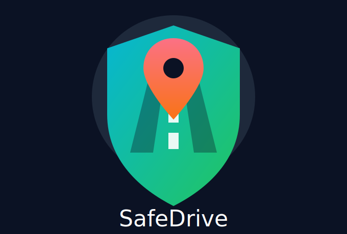

<p align="center">
  
</p>

# SafeDrive — Güvenli Sürüş ve Sürücü Davranış Analizi Platformu

# 🚗 SafeDrive

**Güvenli Sürüş ve Sürücü Davranış Analizi Platformu**

Lojistik ve otobüs firmalarına yönelik gerçek zamanlı sürücü takip sistemi. Sürücünün telefonundaki sensörler (ivmeölçer, jiroskop, GPS) veri toplar, backend'e gönderir, sistem anomali tespit eder ve şirket paneline anlık olarak iletir.

---

## ✨ Özellikler

-  **Gerçek zamanlı araç takibi** — Leaflet haritasında canlı konum
-  **Otomatik anomali tespiti** — Ani fren, sert dönüş, hız ihlali vb.
-  **Sürücü skoru** — 0–100 arası dinamik puanlama sistemi
-  **Anlık alarm bildirimleri** — Socket.io ile sıfır gecikmeli bildirim
-  **7 günlük skor grafiği** — Sürücü performans trendi
-  **Hız sınırı kontrolü** — OpenStreetMap Overpass API entegrasyonu
-  **Uygulama indirme yok** — Mobil tarayıcıda çalışır
-  **Bulut tabanlı** — Render + Vercel + MongoDB Atlas

---

## 🏗️ Sistem Mimarisi

```
[📱 Mobil HTML Sayfası]
   DeviceMotionEvent  →  ivmeölçer (x,y,z) + jiroskop (alpha,beta,gamma)
   Geolocation API    →  latitude, longitude, speed
   Her 2 saniye       →  POST /api/sensor-data  (JWT Bearer)
           │
           ▼
[⚙️ Node.js + Express — Render]
   JWT doğrulama → veriyi kaydet → anomali kontrol et
   Alarm üret    → skoru güncelle → Socket.io emit et
           │                    │
           ▼                    ▼
[🗄️ MongoDB Atlas]     [💻 React Web Paneli — Vercel]
   users               Canlı harita (Leaflet)
   devices             Alarm listesi
   sensorData          Sürücü skor tablosu
   alarms              Gerçek zamanlı ivme grafiği
   companies           Toast bildirimleri
   driverProfiles
```

---

## 🛠️ Teknolojiler

| Katman | Teknoloji | Açıklama |
|---|---|---|
| Backend | Node.js + Express.js | REST API geliştirme |
| Gerçek Zamanlı | Socket.io | Canlı veri akışı ve alarm bildirimleri |
| Veritabanı | MongoDB + Mongoose | Sensör verisi ve kullanıcı yönetimi |
| Kimlik Doğrulama | JWT + bcrypt | Güvenli giriş ve rol tabanlı yetki |
| Web Paneli | React + Vite | Hızlı ve modern frontend |
| Grafik | Chart.js | Canlı ivme ve skor grafikleri |
| Harita | Leaflet + OpenStreetMap | Araç konumu ve hız sınırı verisi |
| Mobil | HTML5 + DeviceMotion API | Telefon sensörlerine tarayıcıdan erişim |
| Deploy | Render + Vercel + MongoDB Atlas | Bulut tabanlı tam deployment |

---

## 👥 Kullanıcı Rolleri

### 🔴 Sistem Yöneticisi (Admin)
- Tüm kullanıcıları ve cihazları yönetir
- Şirket başvurularını onaylar
- Tüm alarm ve verilere erişir

### 🔵 Lojistik Şirketi
- Kendi filosunu haritada canlı izler
- Sürücü skorlarını ve 7 günlük grafikleri takip eder
- Anlık alarm bildirimleri alır

### 🟢 Sürücü
- Telefon tarayıcısında mobil uygulamayı kullanır
- Şirket seçerek kayıt olur
- Kendi skorunu ve anlık uyarıları görür

---

## ⚙️ Kurulum

### Gereksinimler

- Node.js v18+
- MongoDB (yerel) veya MongoDB Atlas hesabı
- npm veya yarn

### Backend

```bash
# Repoyu klonla
git clone https://github.com/kullanici-adi/safedrive-backend.git
cd safedrive-backend

# Bağımlılıkları yükle
npm install

# .env dosyasını oluştur
cp .env.example .env
```

`.env` dosyasını düzenle:

```env
MONGO_URI=mongodb://localhost:27017/safedrive
JWT_SECRET=gizli_anahtariniz
PORT=5000
```

```bash
# Geliştirme modunda başlat
npm run dev

# Üretim modunda başlat
npm start
```

Sunucu `http://localhost:5000` adresinde çalışmaya başlar.

### Frontend

```bash
cd safedrive-frontend
npm install

# .env dosyasını oluştur
echo "VITE_API_URL=http://localhost:5000" > .env

npm run dev
```

Panel `http://localhost:5173` adresinde açılır.

### Mobil Uygulama

Backend çalışırken tarayıcıdan şu adresi aç:

```
http://localhost:5000/mobile.html
```

**Telefon için (HTTPS gerekli):**

```bash
# ngrok ile HTTPS tüneli aç
ngrok http 5000

# Çıkan https://xxxx.ngrok-free.app adresini telefonda aç
```

### Docker ile MongoDB

```bash
docker run -d \
  --name safedrive-mongo \
  -p 27017:27017 \
  -v safedrive-mongo-data:/data/db \
  mongo:7
```

---

## 📡 API Dokümantasyonu

### Auth Endpoint'leri

| Method | Endpoint | Açıklama | Yetki |
|---|---|---|---|
| POST | `/auth/register` | Sürücü kaydı | Herkese açık |
| POST | `/auth/login` | Sürücü girişi → JWT döner | Herkese açık |
| POST | `/auth/register-company` | Şirket kaydı | Herkese açık |
| POST | `/auth/login-company` | Şirket girişi → JWT döner | Herkese açık |

### Veri Endpoint'leri

| Method | Endpoint | Açıklama | Yetki |
|---|---|---|---|
| GET | `/api/companies` | Şirket listesi | Herkese açık |
| POST | `/api/sensor-data` | Sensör verisi gönder | JWT (driver) |
| GET | `/api/sensor-data` | Geçmiş veriler | JWT |
| GET | `/api/alarms` | Alarm listesi | JWT |
| PATCH | `/api/alarms/:id` | Alarmı çözüldü işaretle | JWT (admin) |
| GET | `/api/devices` | Cihaz listesi | JWT |
| POST | `/api/devices` | Cihaz kaydet | JWT |
| GET | `/api/users` | Kullanıcı listesi | JWT (admin) |
| GET | `/api/driver-profile` | Kendi profilini getir | JWT (driver) |
| POST | `/api/driver-profile` | Profil oluştur | JWT (driver) |
| GET | `/api/driver-profiles` | Şirket sürücü listesi | JWT (company) |

### Örnek İstek — Sensör Verisi Gönderme

```http
POST /api/sensor-data
Authorization: Bearer <JWT_TOKEN>
Content-Type: application/json

{
  "deviceId": "64f1a2b3c4d5e6f7a8b9c0d1",
  "timestamp": "2024-01-15T09:02:33.000Z",
  "accelerometer": {
    "x": -10.3,
    "y": 0.2,
    "z": 9.8
  },
  "gyroscope": {
    "alpha": 0.1,
    "beta": -1.5,
    "gamma": 2.3
  },
  "location": {
    "latitude": 40.2201,
    "longitude": 28.8481,
    "speed": 65
  }
}
```

### Örnek Yanıt

```json
{
  "message": "Veri kaydedildi",
  "alarm": {
    "type": "HARD_BRAKE",
    "severity": "critical",
    "value": -10.3
  }
}
```

---

## ⚠️ Anomali Tespiti

Her sensör verisi geldiğinde `anomalyDetector` modülü devreye girer. İlk eşleşen anomali alarm üretir ve skoru düşürür.

| Alarm Türü | Kural | Şiddet | Skor Etkisi |
|---|---|---|---|
| Ani Fren | `acceleration.x < -8 m/s²` | Kritik | -10 puan |
| Ani Hızlanma | `acceleration.x > 10 m/s²` | Yüksek | -5 puan |
| Sert Dönüş | `gyroscope.gamma > ±150 °/s` | Yüksek | -7 puan |
| Sarsıntı | Son 5 ölçüm std sapması > 4 | Orta | -3 puan |
| Hız Sınırı Aşımı | GPS hızı > OpenStreetMap limiti | Yüksek | -8 puan |

**Hız Sınırı Kontrolü:**
Her sensör verisinde GPS koordinatına göre OpenStreetMap Overpass API'den yolun hız sınırı sorgulanır. API 5 saniye içinde cevap vermezse kontrol atlanır. Veri yoksa varsayılan değerler kullanılır:

- Şehir içi: 50 km/h
- Diğer yollar: 90 km/h
- Otoyol: 120 km/h

---

## 🏆 Sürüş Skoru Sistemi

Her sürücü **100 puan** ile başlar. Kötü davranışlarda düşer, 10 dakika temiz sürüşte +1 kazanılır (maks 100).

| Davranış | Puan Değişimi |
|---|---|
| Ani Fren (critical) | -10 |
| Hız Sınırı Aşımı (high) | -8 |
| Sert Dönüş (high) | -7 |
| Ani Hızlanma (high) | -5 |
| Sarsıntı (medium) | -3 |
| 10 dakika alarm yok | +1 |

Skor renk skalası: 🟢 80–100 · 🟡 60–79 · 🔴 0–59

---

## 🗄️ Veritabanı Modeli

### users
```
_id         ObjectId
username    String (unique, required)
email       String (unique, required)
password    String (bcrypt)
role        enum: 'admin' | 'driver' | 'company'
createdAt   Date
```

### companies
```
_id         ObjectId
name        String (unique, required)
email       String (unique, required)
password    String (bcrypt)
createdAt   Date
```

### devices
```
_id         ObjectId
deviceId    String (unique, required)
owner       ObjectId → users
companyId   ObjectId → companies
platform    enum: 'android' | 'ios' | 'web'
lastSeen    Date
```

### sensorData
```
_id             ObjectId
deviceId        ObjectId → devices
timestamp       Date (indexed, required)
accelerometer   { x, y, z: Number }
gyroscope       { alpha, beta, gamma: Number }
location        { latitude, longitude, speed: Number }
```

### alarms
```
_id         ObjectId
deviceId    ObjectId → devices
type        enum: 'HARD_BRAKE' | 'SHARP_TURN' | 'RAPID_ACCELERATION' | 'VIBRATION' | 'SPEED_LIMIT_EXCEEDED'
severity    enum: 'low' | 'medium' | 'high' | 'critical'
value       Number
speedLimit  Number (opsiyonel)
resolved    Boolean (default: false)
timestamp   Date
```

### driverProfiles
```
_id           ObjectId
userId        ObjectId → users (unique)
firstName     String
lastName      String
companyId     ObjectId → companies
score         Number (0–100, default: 100)
scoreHistory  [{ score, reason, change, timestamp }]
```

---

## 🧪 Test

Sistemin temel akışlarını test etmek için Postman koleksiyonu repo'da mevcuttur.

| # | Senaryo | Beklenen |
|---|---|---|
| 1 | Geçersiz token ile `/api/sensor-data` | 401 Unauthorized |
| 2 | Driver rolüyle `/api/users` | 403 Forbidden |
| 3 | `x=-10` ivme gönder | HARD_BRAKE alarmı, -10 puan |
| 4 | `gamma=160` jiroskop gönder | SHARP_TURN alarmı |
| 5 | Aynı `deviceId` ile iki kayıt | 409 Conflict |
| 6 | Hatalı şifre ile giriş | 401 Unauthorized |
| 7 | Socket.io açıkken alarm gönder | Panel anlık bildirim alır |

---

## ☁️ Deploy

| Servis | Kullanım |
|---|---|
| **MongoDB Atlas** | Bulut veritabanı. `MONGO_URI` env variable olarak Render'a eklenir. |
| **Render** | Node.js backend. GitHub'a bağlı, her push'ta otomatik deploy. HTTPS otomatik. |
| **Vercel** | React frontend. `npm run build`, output: `dist`. API istekleri Render URL'ine yönlendirilir. |

> **Not:** Render deploy sonrası telefon sensörleri (DeviceMotionEvent, GPS) otomatik çalışır — HTTPS zorunluluğu bu sayede karşılanır.

---

## 👨‍💻 Ekip

| İsim | Öğrenci No | Görev |
|---|---|---|
| Nihat Efe Bozkan | 22360859033 | backend , anomali tespiti , hız sınırı kontrolu , postman test kontrolü  |
| Muhammet Uğur Yaman | 22360859023 | harita entegrasyonu , skor grafikleri ve tabloları , surus skoru , sensör entegrasyonu , proje raporu ve dokumantasyon  |
| Yunus Emre Nallı | 22360859079 | web paneli , mobil html , dashboard , deploy |

---

<p align="center">
  
</p>

# SafeDrive — Güvenli Sürüş ve Sürücü Davranış Analizi Platformu

**Bursa Teknik Üniversitesi — Bilgisayar Mühendisliği — Node.js ile Web Programlama — 2025–2026**
